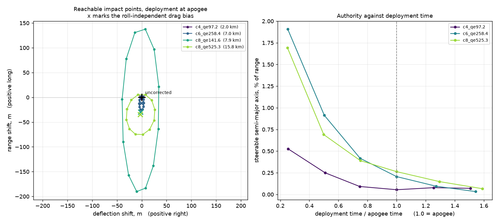
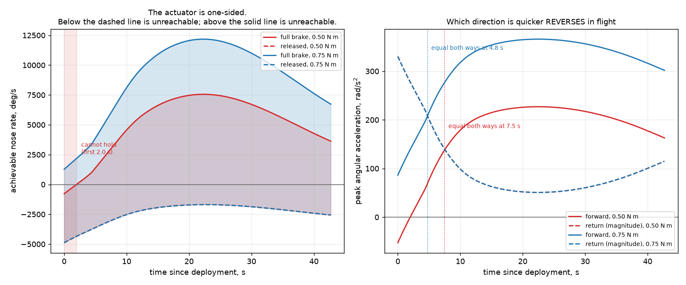
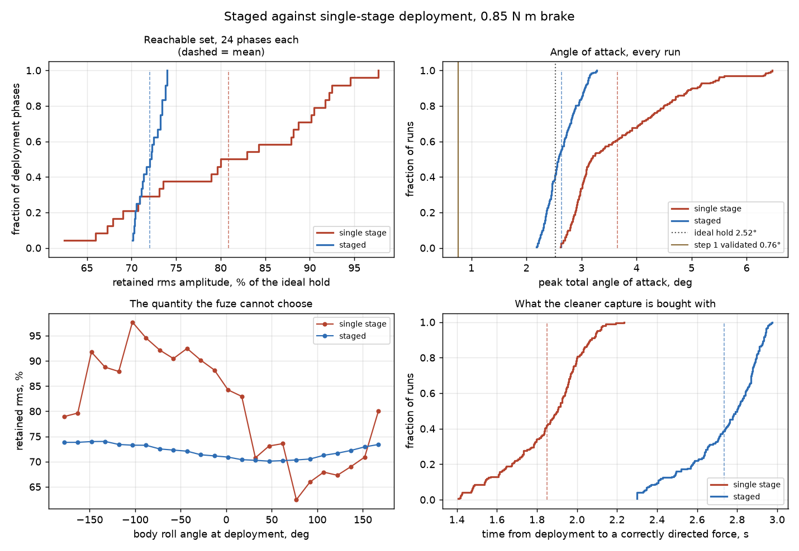
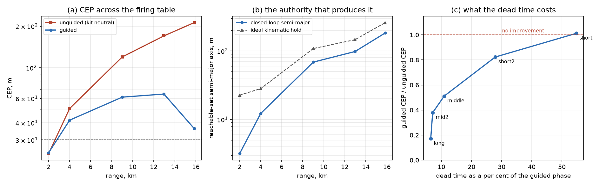
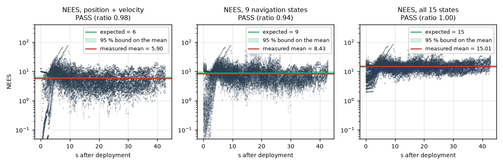
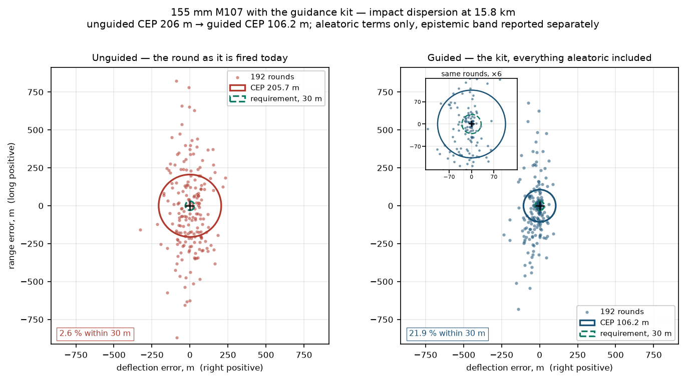

# Flight Dynamics — 155 mm Spin-Stabilised Projectile

Two models of the same shell, driven by the same inputs, plus the guidance
kit that flies on it:

- **`sim/` — a validated six-degree-of-freedom rigid-body simulator** for
  ballistic and canard-corrected flight. The ground-truth model.
- **`models/mpmm.py` — a reduced-order modified point-mass model**
  (STANAG 4355 form), the model that would run on the flight computer.
- **`sim/canards.py` — a despun-nose canard kit** fitted to the 6-DOF: two
  extra states, a four-panel canard model, and an open-loop measurement of how
  far it can move the impact point.
- **`gnc/` — the control and guidance that fly it**: a closed-loop roll-angle
  servo for the despun nose, a staged deployment law, and a guidance loop that
  propagates the reduced-order model to impact and inverts the reachable set to
  decide where to point.
- **`analysis/monte_carlo.py` — the dispersion campaign** that flies the whole
  loop against realistic round-to-round variation, including a realised
  atmosphere and the met message fire control lays the gun on, and produces the
  project's accuracy figure with an account of what is in it.

**The headline result is that this kit is knowledge-limited rather than
authority-limited.** The met message's error is 97 % of the uncorrected range
variance and the guidance loop cannot correct it, because the same error that
displaces the round corrupts the impact-point prediction the law steers by. See
[the dispersion section](#dispersion-and-the-headline-accuracy-figure).

Both trajectory models are fed the same coefficient tables, the same
atmosphere and the same projectile definition. `models/mpmm.py` contains no
coefficient of its own, and a test enforces that by parsing the module.

**`sim/canards.py` is the one module whose aerodynamics are estimated rather
than measured**, and it says so at length: every estimated quantity carries a
named method and an expected accuracy in a machine-readable register, and a
test fails if a new tunable constant is added without one.

**Scope.** Numerical simulation and control algorithms only: flight dynamics,
atmosphere, Kalman filtering, trajectory prediction. Nothing in this repository
relates to explosives, energetics, detonation trains or initiation circuitry,
and no such work is in scope.

---

## Quick start

```bash
pip install numpy scipy matplotlib pytest      # scipy is not used by sim/, only by tooling

python run_ballistic.py                        # one 6-DOF trajectory + plots
python run_validation.py                       # the full validation ladder
python -m analysis.mpmm_compare                # MPMM vs 6-DOF over the envelope
python -m analysis.mpmm_compute                # MPMM compute-cost study
python -m analysis.authority                   # canard correction-authority sweep
python -m analysis.authority_report            # its tables and figure
python -m analysis.roll_servo                  # roll-servo characterisation
python -m analysis.roll_robustness             # roll servo against plant uncertainty
python -m analysis.roll_servo_report           # its tables
python -m analysis.roll_servo_figures          # its figures
python -m analysis.staged_deployment           # staged vs single-stage deployment
python -m analysis.staged_deployment_report    # its tables
python -m analysis.staged_deployment_figures   # its figures
python -m analysis.guidance_authority          # calibrate the inverse map (~1.5 h)
python -m analysis.guidance_cep --tasks c,c2,r,d,d2,e,e2,f,f2,g   # closed loop (~6 h)
python -m analysis.guidance_report             # its tables
python -m analysis.guidance_figures            # its figures
python -m analysis.nav_ablation --tasks f      # authority-monitor false alarms (1 s)
python -m analysis.nav_ablation                # the full error decomposition (~2 h)
python -m pytest tests -q                      # 355 unit tests
```

`run_ballistic.py` writes four figures to `docs/figures/`: trajectory profile,
ground track, angle-of-attack history, and stability diagnostics.

```bash
python run_ballistic.py --charge 8 --qe-mils 248.4    # a firing-table point
python run_ballistic.py --charge 7 --qe-deg 30 --dt 1e-4
python run_ballistic.py --wind-north -10              # 10 m/s head wind
python run_ballistic.py --no-coriolis --no-plots
```

Every run prints an aerodynamic-coefficient confidence banner first. That is
deliberate and is not suppressible: see [Known limitations](#known-limitations).

---

## Results

### 6-DOF against firing table FT 155-AM-2

155 mm M107, charge 8 (684 m/s):

| QE (mils) | Range (m) | vs FT | TOF (s) | vs FT | Drift (m) | vs FT |
|---|---|---|---|---|---|---|
| 141.6 | 7942 | −0.73 % | 16.81 | −1.11 % | +43.3 R | +15.1 % |
| 248.4 | 10940 | −0.55 % | 26.87 | −1.20 % | +106.4 R | +15.1 % |
| 525.3 | 15841 | −0.99 % | 48.49 | −0.84 % | +328.6 R | +12.2 % |

Over all 15 firing-table points (5 charges, 2–16 km): range RMS **0.48 %**,
mean **+0.00 %**; TOF RMS **0.52 %**; drift mean **+14.4 %** (limitation 3).
Drift is to the right in 15 of 15, as a right-hand-rifled shell must be, and
reversing the rifling reverses it.

### 6-DOF against the fully specified ASAT-13 §4.3 case

Every input for this case is given by the source:

| | Model | Published | Error |
|---|---|---|---|
| initial axial deceleration | 4.468 g | 4.45 g | **+0.40 %** |
| total flight time | 66.194 s | 66.67 s | **−0.71 %** |
| summit time | 30.36 s | ~31 s | −2.06 % |
| peak total angle of attack | 1.2975° | ~1.3° | −0.19 % |

### Stability and numerics

- Gyroscopic stability factor `Sg > 1` at every logged sample of every run
  (minimum 2.58, rising to 13.09), for the nominal 1-turn-in-20-calibres tube.
- Halving the timestep from 2×10⁻⁴ to 1×10⁻⁴ s moves range by 0.021 m in
  15 841 m (1.3 ppm) and drift by 0.07 m in 317 m.
- Vacuum trajectories match the analytic parabola to < 10⁻⁶ % at five
  elevations, with drift identically zero.

### Reduced-order model against the 6-DOF

Same 15 engagements, same coefficients, no fitting factors. Differences are
MPMM minus 6-DOF, RMS over the envelope:

| Quantity | default | with `iterate_yaw=True` |
|---|---|---|
| Range | 0.079 % (6.60 m) | **0.030 % (1.58 m)** |
| Deflection | 0.715 % (1.18 m) | **0.115 % (0.11 m)** |
| Time of flight | 0.028 s | |
| Impact velocity | 0.058 m/s | |
| Impact angle | 0.006° | |

Initialised from a true 6-DOF state at apogee and propagated to impact — the
way an impact-point-prediction law would use it — the **model error is 0.65 m
RMS in range and 0.06 m RMS in deflection** (worst case 1.24 m and 0.09 m).

One worst-case impact prediction is **about 1050 derivative evaluations** at
the recommended dt = 0.1 s, or 13 % of a 100 ms duty cycle even in CPython.
Step-size error is dominated by the linear impact interpolation, not by RK4.

### Canard correction authority

Open loop, 15 engagements, canards deployed at apogee, nose held at a fixed
earth-referenced roll angle:

| | |
|---|---|
| Steerable authority | **0.05–2.10 % of range, median 0.20 %** |
| Reachable-set shape | ellipse, major axis on **range**, axis ratio 1.44–9.35 |
| Roll-independent drag bias | −1.5 to −34.9 m of range, always shortening |
| Engagements that cannot lengthen range at all | 5 of 15 |
| Decay, quarter-apogee to 1.6× apogee | factor of **25–58** |

**The correction is rotated about −75° from the canard force**, and is a third
force rather than the difference of two. Both the canard force and the induced
body normal force act ahead of the CG on a spin-stabilised shell, so moment
balance makes them oppose; the M107's subsonic centre of pressure sits at
0.71–0.93 calibre from the nose, essentially at the fuze-well canard station,
so they cancel to about 5 %. What survives is the **Magnus force**, which is
perpendicular to the angle of attack and is 15 % of the normal force — three
times the residue. Measured decomposition, closed form and the published
literature all agree; see
[AUTHORITY-RESEARCH.md](docs/AUTHORITY-RESEARCH.md).

The model that produces these numbers was verified against a published 155 mm
spin-stabilised configuration and reproduces its published swerve response to
**0.3–2.4 %** ([MODEL-VERIFICATION.md](docs/MODEL-VERIFICATION.md)), so the
figure is a property of the design and not of the simulation.

**The design has since been revised.** A sweep of the admissible space
([DESIGN-SWEEP.md](docs/DESIGN-SWEEP.md)) found that the deployment point is
worth 6.4× and everything else tens of per cent: canards at 25 mm from the
nose, 3° of steering deflection and deployment at a quarter of the apogee time
give **1.64 % of range at a *smaller* trim angle of attack than the nominal**.
The consequences for achievable CEP, and the conditions attached to them, are
in [ARCHITECTURE-DECISION.md](docs/ARCHITECTURE-DECISION.md).

Full account of the original envelope, including the investigation of the four
candidate errors and the sweeps that exclude each of them, in
[AUTHORITY-ENVELOPE.md](docs/AUTHORITY-ENVELOPE.md).



### Roll-angle servo

The kit steers by holding the despun nose at a commanded roll angle. The
actuator is an electromagnetic brake, and it is **one-sided**: it can only
clutch the nose to the spinning body and drag it forward. The return path is
passive — release the brake and the canted canards despin the nose again.

| | |
|---|---|
| Structure | gain-scheduled cascade on dynamic pressure: P on angle → rate, PI on rate + feed-forward, conditional integration |
| Closed-loop bandwidth | **1.34–1.36 Hz**, flat to ±1 % across a 3.5× swing in dynamic pressure |
| Slew, 90° | 0.33–0.44 s forward, 0.33–0.48 s on the passive return |
| Overshoot | ≤ 0.035 % anywhere |
| Steady-state tracking error | **0.55° mean**, losing 59 ppm of the commanded correction |
| Acquisition from deployment | **1.5–2.1 s** |
| Reachable set retained against an ideal hold | **62–98 % of rms amplitude** single stage, **70–74 %** staged — see below |

Four findings the open-loop work could not have produced:

- **The step-2.5 brake is undersized.** Moving deployment to a quarter of the
  apogee time — the change that bought 6.4× the authority — raised the canard
  despin torque to 0.68 N m against a 0.50 N m brake. The nose cannot be held
  for the first 2 s. **0.85 N m** is required, sized against the upper bound of
  the ±30 % canard aerodynamic estimate.
- **Tracking error is not a CEP term and acquisition is.** The servo's whole
  cost is the capture transient, which excites the shell's coning motion by an
  amount that depends on the body roll phase at capture — and the shell turns
  208 times a second, so it is a random 15–23 % loss of authority, not a
  deterministic discount.
- **The duty-cycle magnitude-control scheme does not work.** Switching between
  0.9 and 2.5 s resonates with the slow yawing mode; at a 1 s period the
  delivered correction is *inverted*. Use one contiguous hold of variable
  length, which is monotone and switches once.
- **Bearing friction is not the risk; the canard aerodynamics are.** The loop
  survives the whole ±60 %/±70 % bearing band and fails inside the ±30 %
  aerodynamic one.

[CONTROL-CHARACTERISATION.md](docs/CONTROL-CHARACTERISATION.md),
[CONTROL-ROBUSTNESS.md](docs/CONTROL-ROBUSTNESS.md),
[STEP4-CLOSEOUT.md](docs/STEP4-CLOSEOUT.md).



### Staged deployment

The servo's whole cost is the acquisition transient: the nose despins from
1308 rad/s with the steering canards already out, sweeping the steering force
through several revolutions and capturing at a body roll phase the fuze cannot
choose. Releasing the **cant pair first** and the **steering pair once the nose
has stopped turning** removes it.

Measured over **24 deployment phases per configuration**, 15° of body roll
apart, at the adopted 0.85 N m brake:

| | single stage | **staged** |
|---|---|---|
| peak total angle of attack | 3.65° ± 0.95, worst 6.47° | **2.63° ± 0.28, worst 3.28°** |
| — above the ideal kinematic hold's 2.52° | +1.13° | **+0.11°** |
| retained rms amplitude | 80.9 % ± 10.6 | **72.0 % ± 1.4** |
| reachable-set axis ratio | 1.79 ± 0.72, worst 4.14 | **1.17 ± 0.05** (ideal 1.20) |
| time to a directed steering force | 1.85 s | 2.74 s |

**Staging removes 90 % of the servo's angle-of-attack excursion and 98 % of the
variance of its reachable set, and costs 8.8 points of mean authority, 0.89 s
of dead time, and a second release mechanism.** It is recommended on the
mechanism, not on CEP: the mean authority is lower, and the staged semi-major
axis sits 0.8 m below the 186.3 m that
[ARCHITECTURE-DECISION.md](docs/ARCHITECTURE-DECISION.md) requires at an
uncorrected CEP of 200 m. That one number is the argument against, it is stated
as such, and step 6 should settle it. **Step 6 settled it and staging stands**:
flown over the full dispersion, paired on common random numbers, single stage
is worse by 21.2 m of CEP and worse on 63.5 % of paired rounds (sign test
p = 0.010). [STAGING-DECISION-FINAL.md](docs/STAGING-DECISION-FINAL.md).

**Step 4's five-phase band was five times too narrow.** Its 77.5–84.5 % is
62.4–97.7 % at 24 phases. The mean was right to a fifth of a point.

[STAGED-DEPLOYMENT.md](docs/STAGED-DEPLOYMENT.md),
[STEP4-ADDENDUM.md](docs/STEP4-ADDENDUM.md).



**That one number does not survive step 3.** The 186.3 m requirement is
`required_authority(..., axis_ratio=1.20)`, and the staged configuration's
measured axis ratio is 1.10, at which the same arithmetic requires 174–179 m.
Staged clears it. See below.

### Guidance, closed loop

The reachable set is a first-harmonic ellipse to 1.6 %, so it can be
**inverted** rather than sampled: a table of 2×2 matrices indexed on time to
go, 20 nodes of six floats — **480 bytes** — and one 2×2 solve per cycle turns a
desired ground-plane correction into a commanded roll angle. Flown out of
sample at twelve directions, it points to **0.84° rms, 1.61° worst**.

Each cycle the step-2 reduced-order model is propagated to impact and
differenced against the target. **1 Hz, set by the servo and not by the CPU**:
0.5, 1 and 2 Hz are indistinguishable and 5 Hz is measurably *worse* — a paired
median of +1.6 m on 69 % of rounds — because the command is then changing faster
than the nose can follow.

| adopted engagement, uncorrected CEP 200 m | closed-loop CEP |
|---|---|
| as published (224 m aim-off) | **36.3 ± 17.5 m** |
| gun laid at the configuration's own optimum | **29.7 ± 19.1 m** |
| perfect guidance at the same reachable set | 20.7 m |

**Five findings, and two of them are negative:**

- **There is no scheduling problem.** An explicit budget law with a 25 % held
  reserve is *identical* to naive null-seeking — paired median 0.00 ± 0.00 m —
  because the correction budget is perishable: the reachable set expires
  whether or not it is spent. The right law never releases. Closing the loop
  is worth 13 m against deciding once.
- **The published 224 m aim-off is 40 m too long** for the kit that was
  adopted. The steering pair's first four seconds cost 90 m of range, and
  staging does not pay them.
- **Below about 4 km the kit does nothing.** At 2 km it produces 3.2 m of
  authority and a CEP of 24.2 m against an unguided 23.9 m. The dead time is
  2.65–3.30 s at *every* engagement, which is 6 % of the guided phase at
  15.8 km and **55 %** at 2 km.
- **The semi-minor axis is what predicts closed-loop performance**, not the
  semi-major the project's criterion is written against. Across five
  engagements the guided-to-unguided ratio is ordered perfectly by
  `b / CEP_uncorrected` and imperfectly by `a / CEP_uncorrected`.
- **CEP ≤ 30 m has not been demonstrated.** 29.7 m is the best figure, at one
  engagement, at the best aim-off, against an assumed dispersion, with
  navigation and atmospheric error still excluded. The design sits at its
  requirement with no margin.

[STEP3-CLOSEOUT.md](docs/STEP3-CLOSEOUT.md),
[INVERSE-MAP.md](docs/INVERSE-MAP.md),
[GUIDANCE-DESIGN.md](docs/GUIDANCE-DESIGN.md),
[AIM-OFF.md](docs/AIM-OFF.md),
[DEGRADATION-LADDER.md](docs/DEGRADATION-LADDER.md),
[CEP-CLOSED-LOOP.md](docs/CEP-CLOSED-LOOP.md).



---

### Navigation

**The sensor layout is decided by one measurement, not by preference.** The
body turns 74 952 °/s at deployment and 56 132 °/s at impact, so a body-mounted
roll gyro is **pinned at full scale for 100 % of the flight at every full scale
up to 8 000 °/s** — and it does not fail, it returns a plausible constant. A
body-mounted accelerometer 25 mm off the axis sees **4 138 g** against a 1.8 g
flight signal; staying inside a ±40 g part would need the proof mass on the
axis to **0.242 mm**.

In the despun section all of it collapses, and an exact identity makes that
more than convenient: the nose frame's own 3-2-1 Euler roll **is**
`phi_body + phi_rel`, the variable the servo controls, verified to 6.3e-12 rad.
The IMU does not infer the controlled variable; it is that variable.

**The filter is consistent, and that is the result that licenses the rest.**
A 15-state loosely-coupled error-state EKF, over 4 engagements × 16 sensor
seeds:

| NEES | dimension | measured | 95 % bounds |
|---|---|---|---|
| position + velocity | 6 | **5.90** | [5.18, 6.88] |
| 9 navigation states | 9 | **8.43** | [7.99, 10.07] |
| all 15 states | 15 | **15.01** | [13.69, 16.37] |

Getting there needed a finding that inverted the obvious fix: **inflating the
measurement noise cannot buy consistency.** Inflating the GNSS position R by
200× moved the NEES from 91 to 38 against an expected 6 *and made the position
error worse*, 3.5 m → 20.7 m. What worked was a Schmidt-Kalman consider floor,
derived from the sensor specs rather than fitted, which improved the NEES by a
factor of 450 **and** halved the error.

**Roll, reported as bias and noise separately** because
[CONTROL-CHARACTERISATION.md §4.3](docs/CONTROL-CHARACTERISATION.md) measured
that they cost differently: **bias 0.54° mean, 3.28° worst of 64; noise
2.3–2.9° 1σ.** The bias takes the servo's tracking error from 0.55° to 1.1°
and costs 4 cm of a 246 m semi-major axis. Roll is not a CEP term through the
servo's pointing.

**The navigation contribution to CEP is, and it is the largest number in this
step:**

| engagement | range | contribution, range 1σ | deflection 1σ |
|---|---|---|---|
| short2 | 4.0 km | 4.3 m | 1.1 m |
| middle | 9.0 km | 17.6 m | 6.3 m |
| mid2 | 13.0 km | 28.2 m | 7.4 m |
| **long** | **15.8 km** | **30.4 m** | **12.0 m** |

**A 30 m 1σ in range is not a correction to step 3's 36.3 m, it is a doubling
of it — so CEP ≤ 30 m is not met with navigation error included.**

**Step 5.5 decomposed that 30.4 m two independent ways and the largest term is
not a navigation error at all.** In **deflection** the decomposition closes
cleanly and it is lateral velocity error, dominated by a spinning GNSS antenna
whose 10 mm phase centre moves at 13 m/s. In **range** it does not: the
**authority monitor** of step 3 — whose thresholds were sized against
prediction error measured with the guidance law reading *truth* — false-fires
on 42 % of navigation-fed rounds at the short engagement and 5.6 % at the long
one, against **0 of 24 truth-fed rounds**, and those rounds carry **24–74 % of
the variance**. Removing every sensor error in the kit at once improves the
velocity solution a hundredfold and moves the range contribution by
**+3.35 ± 2.14 m**, i.e. not at all.

**The navigation requirement on this kit is a velocity requirement in
deflection and a guidance-law threshold problem in range**, and the second was
invisible until the sensitivity and the ablation were made to disagree.

[STEP5-CLOSEOUT.md](docs/STEP5-CLOSEOUT.md),
[SENSOR-MODELS.md](docs/SENSOR-MODELS.md),
[NAV-CONSISTENCY.md](docs/NAV-CONSISTENCY.md),
[NAV-CEP.md](docs/NAV-CEP.md),
[NAV-DEGRADATION.md](docs/NAV-DEGRADATION.md),
[NAV-ERROR-DECOMPOSITION.md](docs/NAV-ERROR-DECOMPOSITION.md),
[NAV-CHATTER.md](docs/NAV-CHATTER.md).



### Dispersion, and the headline accuracy figure

**Everything above measured one contributor with the others held still. This
flies the whole loop against realistic dispersion, with every per-round random
variable drawn independently for every round** — muzzle velocity, projectile
mass and both inertias, quadrant elevation, azimuth, the wind and density
profile actually flown, the met message fire control holds, the fuze setting
and therefore the deployment phase, and a **different sensor seed on every
round**.

| | **headline** | **fresh met** | **modelled dispersion** |
|---|---|---|---|
| uncorrected dispersion | the assumed 200 m CEP | assumed 200 m | as the physics produces it |
| met message | 2 h old | **at fuze setting** | 2 h old |
| **CEP** | **106.2 m** | **27.5 m** | **59.5 m** |
| 95 % interval | [91.5, 130.1] | [19.2, 74.0] | [34.2, 75.4] |
| **within 30 m** | **21.9 %** | **51.0 %** | **32.8 %** |
| unguided, same rounds | 205.7 m | 145.1 m | 140.3 m |
| rounds | 192 | 96 | 64 |

**CEP ≤ 30 m is not met.** At a two-hour-old met message the design misses the
requirement by a factor of 3.5. With a met message uploaded at fuze setting the
point estimate is 27.5 m — but its 95 % interval runs to 74 m, and **that is
not a claim of compliance**: 51 % of rounds land within 30 m, so the median
sits exactly on the requirement and the CEP is a threshold statistic there.



**The finding that reorders the project: the kit is knowledge-limited, not
authority-limited.**

- The **met message's error is 97 %** of the modelled uncorrected range
  variance — 170.7 m against 56.9 m for muzzle velocity, laying and shell
  variation put together. Inside it, wind is 81 %.
- And the kit **cannot correct it**. A guidance law that steers by predicting
  its own impact point is defeated by a met error, because the same error that
  displaces the round corrupts the prediction. Measured pass-through:
  **0.97 of unity**. At the adopted engagement the kit deploys at 5.55 s of a
  48 s flight, so 88 % of the trajectory is still ahead of the predictor when
  it first runs.
- The same error makes the step-3 authority monitor **false-fire on 36.5 % of
  healthy rounds**, against 5.6 % measured in step 5 and 0 of 24 truth-fed in
  step 3. A drifting prediction looks exactly like a dead actuator.

**Two numbers this project has carried for four steps were wrong, and both are
now measured rather than assumed:**

| | as published | measured here |
|---|---|---|
| the atmospheric term | ~10 m (external reviewer, step 2, mislabelled) | **148 m** of range 1σ at a 2 h message, **126.6 m** without the dispersion top-up |
| the uncorrected dispersion | CEP 200 m, 3:1, assumed since step 2.5 | **142.9 m**, axis ratio **2.34** |

**The band, not the point.** Aleatoric terms are inside the CEP; epistemic ones
are a band around it, because every round of a lot flies the same canards.
**`C_Ypα`, the Magnus force coefficient — a single source, graded LOW, with a
factor-3.3 spread — is worth 72 m of CEP**, more than every other epistemic
term combined. Measuring it is a spark-range job on an existing shell that
depends on the guidance kit not at all, and it would remove the largest single
uncertainty in this figure.

**What would close the gap, in order:** a met message uploaded at fuze setting
(measured: 106.2 → 27.5 m); a measurement of `C_Ypα`; **then** more correction
authority, which is what steps 2.5 to 5 optimised and which is third on the
list; then better navigation, worth 4.8 m.

**Two prior conclusions were tested and one was corrected.** Staged deployment
**stands** — single stage is worse by 21.2 m of CEP and worse on 63.5 % of
paired rounds, sign test p = 0.010 — settling the one result
[STAGED-DEPLOYMENT.md §8.2](docs/STAGED-DEPLOYMENT.md) said could reverse it.
The two "cheap levers" of step 5 do not both survive: the GNSS antenna's
**range** benefit measures **+0.13 m [−3.53, +3.89]** against the −7.5 m
quoted and is **withdrawn**, as is the magnetometer floor; the antenna's
**deflection** benefit is confirmed at **−3.30 m [−5.57, −1.17]**.

**Across the firing table the kit is at its best at maximum range**, and the
improvement factor crosses unity between 2 and 4 km — which is a specification,
not a defect, because the uncorrected dispersion scales with range and at 2 km
it is already inside the requirement without the kit:

| engagement | range | unguided | **guided** | ≤ 30 m | **improvement** |
|---|---|---|---|---|---|
| short | 2.0 km | 23.0 m | 23.7 m | 60.4 % | **0.97×** |
| short2 | 4.0 km | 49.0 m | 46.6 m | 33.3 % | **1.05×** |
| middle | 9.0 km | 98.8 m | 81.7 m | 18.8 % | 1.21× |
| mid2 | 13.0 km | 170.3 m | 123.8 m | 13.5 % | 1.38× |
| **long** | **15.8 km** | 205.7 m | **106.2 m** | 21.9 % | **1.94×** |

Time to a directed steering force is 2.65–3.30 s at every engagement, set by
the stage-2 release and the servo's acquisition rather than by the trajectory:
6.4 % of the guided phase at 15.8 km, 54.8 % at 2 km.

[MONTE-CARLO-DESIGN.md](docs/MONTE-CARLO-DESIGN.md),
[ATMOSPHERIC-ERROR.md](docs/ATMOSPHERIC-ERROR.md),
[MONITOR-RETUNE.md](docs/MONITOR-RETUNE.md),
[STAGING-DECISION-FINAL.md](docs/STAGING-DECISION-FINAL.md),
[CEP-FINAL.md](docs/CEP-FINAL.md),
[STEP6-CLOSEOUT.md](docs/STEP6-CLOSEOUT.md).


---

## What it does

| | |
|---|---|
| **State** | 15 elements: position and velocity in earth NED, attitude quaternion (body→earth), body angular rates, and the despun nose's roll angle and rate relative to the body |
| **Forces** | axial drag with yaw-drag term, normal force, Magnus force, canard panel forces |
| **Moments** | overturning, Magnus, spin damping, pitch/yaw damping, canard pitch/yaw — about the CG; canard roll onto the nose, with its reaction onto the body |
| **Environment** | ISA 1976 atmosphere, inverse-square gravity, Coriolis, altitude-dependent wind |
| **Integration** | fixed-step RK4, quaternion renormalised every step, impact interpolated to z = 0 |
| **Diagnostics** | gyroscopic and dynamic stability factors, yaw of repose, full truth logging |

### Conventions

Frame and sign conventions are stated at the top of every module and never
deviated from.

- **Earth frame:** NED, origin at the muzzle. X downrange, Y right, **Z down**.
  Gravity is +Z, altitude is −z, impact is z ≥ 0 on the descending branch.
- **Body frame:** x forward out of the nose, y right, z down.
- **Attitude:** quaternion `q = [w,x,y,z]` mapping **body → earth**. Euler 3-2-1.
  Because Z is down, **positive pitch is nose-up**, and quadrant elevation maps
  directly onto θ at launch.
- **Wind** is the **velocity of the air**. A wind *from* the north is a
  **negative** X component.
- **Positive C_Mα is destabilising** — centre of pressure ahead of the CG.
  Gyroscopic stiffness, not aerodynamics, is what keeps a shell nose-forward.
- **Right-hand rifling gives positive spin p**, and the shell must **drift right**.
- **Rifling twist belongs to the gun, not the shell.** The nominal model is
  1 turn in 20 calibres (M185/M199, the tube of firing table FT 155-AM-2).
  `sim/projectile.py::TUBES` records the alternatives with their sources. At
  fixed twist the gyroscopic stability factor does not depend on muzzle velocity
  at all, so quoting an Sg without naming the tube is meaningless.

---

## Layout

```
sim/
  frames.py        quaternion algebra, DCM, Euler conversions
  atmosphere.py    ISA 1976, gravity, wind
  aerodata.py      Mach-interpolated coefficients + full provenance
  projectile.py    physical properties, launch conditions, environment
  dynamics.py      PURE derivative function: state in, derivative out
  integrate.py     RK4, impact detection, trajectory logging
  diagnostics.py   Sg, Sd, yaw of repose
  canards.py       despun nose + four-panel canard kit -- ESTIMATED aerodynamics
gnc/
  roll_control.py  closed-loop roll-angle servo for the despun nose
  inverse_map.py   the reachable set as a table of 2x2 matrices, and its inverse
  scheduler.py     five authority-allocation laws behind one interface
  guidance.py      the 1 Hz cycle: predict, invert, schedule, degrade
models/
  mpmm.py          PURE 7-state STANAG 4355 modified point-mass derivative
analysis/
  pointmass3dof.py           independent 3-DOF reference for validation rung 2
  brl_reference.py           verified BRL MR-1582 transcription, per-digit provenance
  brl_figures.py             figure page map, axis calibration, damping-force table
  coefficient_crosscheck.py  source comparison and the centre-of-pressure test
  rate_convention_audit.py   pd/V vs pd/(2V), and what it is worth
  mpmm_compare.py            MPMM vs 6-DOF; model error; the drift test
  mpmm_compute.py            MPMM compute cost, step size, term ablation
  authority.py               canard correction-authority sweep, open loop
  authority_report.py        its tables and figure, generated from the JSON
  verify_swerve.py           the 6-DOF against Ollerenshaw and Costello 2008
  design_sweep.py            station, deployment, area, deflection, C_Ypalpha
  deployed_stability.py      Sg and Sd with the canards deployed
  cep_projection.py          authority -> achievable CEP, by quadrature
  roll_servo.py              servo characterisation: slew, settling, bandwidth, duty cycle
  roll_robustness.py         servo against bearing and canard-aerodynamic uncertainty
  roll_servo_report.py       its tables, generated from the JSON
  roll_servo_figures.py      its figures
  staged_deployment.py       two-stage canard release against single stage
  staged_deployment_report.py   its tables, generated from the JSON
  staged_deployment_figures.py  its figures
  guidance_authority.py      calibrates the inverse map; prices the predictor
  guidance_cep.py            closed-loop CEP: schedulers, aim-off, ladder, envelope
  guidance_report.py         its tables, generated from the JSON
  guidance_figures.py        its figures
run_ballistic.py     driver, plots, firing-table comparison
run_validation.py    the validation ladder
tests/test_sim.py    6-DOF unit tests    (66)
tests/test_mpmm.py   MPMM unit tests     (24 + 3)
tests/test_canards.py canard and nose unit tests (42)
tests/test_roll_control.py roll servo unit tests (54)
tests/test_staged_deployment.py staged deployment unit tests (20)
tests/test_guidance.py inverse map, schedulers, predictor, ladder (70)
tests/test_guidance_documented_numbers.py the step-3 prose against its JSON (49)
tests/test_navigation.py sensor models, filter, consistency machinery (24)
```

`embedded/` is a placeholder for the C implementation; `gnc/` holds steps 3, 4
and 5.

### `dynamics.py` is pure

State in, derivative out. No I/O, no globals, no hidden state, no mutation of
inputs — the shape that drops into a Monte Carlo harness, a hardware-in-the-loop
rig or a C port without being rewritten. Enforced by
`test_derivative_does_not_mutate_its_input` and `test_derivative_is_deterministic`.

The force and moment model exists **exactly once**, in `_aero_core()`. Both the
hot path and the diagnostic wrapper call it.

### Seams for the guidance, navigation and control work

- **Canard force/moment:** `FlightModel.control` takes an optional
  `control_force_moment(t, state, aero_state)` callback, defaulting to `None`.
  Step 1's two-element `(F_body, M_body)` return is still valid and still
  tested; `sim/canards.py` uses the three-element form
  `(F_body, M_body, T_nose)`, whose third value is the canard roll moment and
  is routed to the **despun nose** rather than to the body.
- **Despun nose, now filled in:** `STATE_SIZE` went from 13 to 15 in one
  place, as promised. `y[13]` is the nose roll angle relative to the body and
  `y[14]` its rate; `FlightModel.nose` carries the bearing and the open-loop
  brake command. With `nose=None` the two states are inert and the model is
  the step-1 model to the last digit — asserted by
  `test_appending_the_nose_states_does_not_disturb_the_ballistic_model`.
- **Roll-angle servo (step 4), now filled in:** `NoseAssembly.brake_command` is
  still a function of **time alone**. It did not need to change: a digital
  controller samples at fixed instants and holds its output in between, so
  inside one RK4 step its command really is a constant. What was added is
  `integrate(step_hook=)`, called once per **completed** step, never inside one,
  which is where `gnc.roll_control.BrakeLaw` updates. The derivative is still
  pure and `test_the_step_hook_does_not_change_the_trajectory` asserts a
  read-only hook is a no-op on the physics.
- **Truth logging:** `Trajectory` logs true position, velocity, attitude
  quaternion, body rates, the nose states and the aerodynamic state, so a
  navigation filter can be differenced against truth.
- **Restart:** `integrate(..., t_start=)` resumes exactly from a logged
  trajectory sample, which is how the authority sweep avoids re-flying the
  shared pre-deployment leg once per commanded roll angle.
- **Guidance (step 3), now filled in, and it added no seam.**
  `gnc.guidance.GuidanceLaw.command` is the same `brake_command`-shaped
  callable `BrakeLaw` already consumed from a duty-cycle commander, and
  `GuidanceLaw.sample` runs inside the step hook the servo already uses.
  `test_guidance_command_is_a_function_of_time_alone` asserts the restriction
  step 2.5 placed on the control seam is not weakened.
- **Navigation (step 5), now filled in, and it added no seam either.**
  `NavigationSystem.sample` is a step hook like the other two and runs FIRST in
  the same chain. The servo and the guidance law read its estimate through one
  optional argument each — `BrakeLaw(..., nav=nav)` and
  `GuidanceLaw(..., nav=nav)` — and `nav=None` restores exactly the truth-fed
  behaviour every step-3 and step-4 number was measured at. **Two runs
  differing only in that argument therefore measure the navigation
  contribution and nothing else**, which is how it is isolated.
  `test_navigation_adds_no_third_seam` pins the shape.

---

## The onboard model — `models/mpmm.py`

Seven states instead of thirteen: position, velocity, axial spin. **No
attitude.** The 6-DOF must resolve a 221 rev/s spin and is therefore stuck at
dt ≈ 2×10⁻⁴ s; the MPMM replaces integrated attitude with STANAG 4355's
**algebraic yaw of repose**

```
alpha_e = -( 8 Ix p (v x dv/dt) ) / ( pi rho d^3 C_Malpha |v|^4 )
```

and takes steps two orders of magnitude larger. `derivative()` is pure, like
`dynamics.derivative`, and returns plain floats for the C port.

### No fitting factors, and a test that says so

Operational STANAG 4355 implementations carry a form factor `i`, a lift factor
`fL`, a Magnus factor `QM` and a yaw-drag factor `QD`, fitted per projectile lot
against firing trials. **All four are present as named constants, all four are
1.0, and `test_all_fitting_factors_are_unity` fails if any of them moves** — it
also fails if the factor set grows, so a new one cannot be added quietly. A
fitted MPMM would reproduce the 6-DOF because it had been *made* to, and the
model-error numbers above would measure the fitting rather than the model.

---

## Known limitations

Read these before quoting any number from this model.

0. **The guided trajectories fly well outside the validated aerodynamic
   range.** Step 1's validation covers a peak total angle of attack of 0.76°.
   An ideal roll hold reaches 2.64°, the closed-loop servo 5.0–6.9°, and a
   1 s duty cycle 11.7°. `C_Mα3` is unavailable and `C_Mpα` is tabulated at
   zero yaw only, so the aerodynamic deck is being extrapolated by a factor of
   7 to 15 in the very trajectories the correction authority is measured on.
   This is the largest single caveat on every guided number in this repository.
1. **Four of eight coefficients rest on a single source.** `C_X0` and `C_Mα` are
   confirmed by a second, independent, *measured* source; `C_Nα` is set by that
   measurement directly. `C_Ypα`, `C_Mpα`, `C_mq` and `C_X2` rest on a computed
   deck alone. There are no placeholder coefficients, and the confidence grade
   per coefficient is printed on every run.
2. **The reduced-rate convention is settled, and it was settled without
   reference to the firing table.** The four rate-dependent coefficients are
   applied with reduced rates pd/(2V) and qd/(2V); the classical aeroballistic
   literature uses pd/V, whose coefficients are half as large for the same
   physics. The deck this model carries is pd/(2V), determined by reproducing
   ASAT-13 §4.3 — that source's own published trajectory, computed with that
   deck. Under pd/V the peak angle of attack moves from t = 32.4 s to
   t = 19.1 s against a published ~32 s, and the yaw history changes from a
   single broad peak to a sustained oscillation. `REDUCED_RATE_FACTOR` in
   `aerodata.py` is the one constant expressing the choice, and the choice
   belongs to the coefficients rather than the equations — replace the table
   with a BRL- or McCoy-sourced one and it must become 1.0. Reproduce the
   audit with `python -m analysis.rate_convention_audit`. **What that audit
   did find** is that BRL's rate coefficients were being compared against the
   deck *across* conventions: the C_Mpα disagreement between the two sources
   is a factor of 3.1, not the 36 % previously recorded.
3. **Drift runs ~14 % high** against the firing table (mean +14.4 % over 15
   points, +5.0 % to +24.8 %, worst where the absolute drift is only a few
   metres). **Unresolved, with no coefficient explanation left.** Every candidate
   has been tested against measurement and eliminated: the twist, `C_Nα`,
   `C_Mα`, the missing pitch-damping force, Coriolis, sign errors and timestep.
   The reduced-order model — a different model class entirely — lands at
   +14.38 % against the same column, agreeing with the 6-DOF's +14.37 % to
   0.115 % RMS, so the cause is in the inputs or the reference data rather than
   in the trajectory integration. Range, TOF, summit and impact velocity are
   unaffected.
4. **The coefficient table stops at Mach 2.00**, and charge 8 launches at
   M 2.01. End values are held flat and the excursion is reported.
5. **Linear aerodynamics only.** `C_Mpα` at 0° yaw; no nonlinear Magnus, no
   limit-cycle modelling. Valid because nominal flight stays below 0.8° yaw.
6. **The 6-DOF is slow, and step 6's Monte Carlo is a compute limit rather
   than a statistical judgement.** 118 µs per RK4 step, so the 48.5 s charge-8
   flight at dt = 2×10⁻⁴ (242 447 steps) takes **28.7 s** of wall clock in pure
   CPython. Step 6 flies the 6-DOF anyway, because the reduced-order model
   cannot represent the servo, the deployment phase or the reachable set — but
   at 14–19 s per navigation-in-the-loop round at eight-way parallelism the
   sample counts are what fits, not what would be ideal. The reduced-order
   model is used where it belongs: the fire-control solution, the fuze setting
   and the onboard impact-point prediction.
7. **The MPMM's default omits the yaw-of-repose iteration**, which costs it a
   factor of 3.5 in range model error and 8 in deflection model error for a 40 %
   saving in compute. `iterate_yaw=True` is recommended; the default keeps the
   simplest closed-form derivative as the baseline for the C port. The MPMM also
   uses a linear overturning moment: STANAG's (C_Mα + C_Mα3·α_e²) cubic term has
   no published value for the M107 in either source used here.
8. **No base bleed, no rocket assist.** Ranges beyond ~24 km are out of family
   for this model and for a standard HE round.
9. **The canard aerodynamics are estimated, not measured.** There is no
   DATCOM run, no wind-tunnel entry and no free-flight data behind
   `sim/canards.py`; every canard coefficient comes from a named engineering
   correlation applied to a geometry this project invented, and the register
   in [CANARD-MODEL.md §8](docs/CANARD-MODEL.md) gives the method and the
   expected accuracy for each. Absolute correction authority carries about
   **±30 %**, dominated by the slender-body body-to-wing carryover factor.
   The *sign* of the correction, its Mach dependence and its saturation with
   panel area come from the measured body deck and do not.
10. **The canard-induced trim angle of attack leaves the validated linear
   range.** At the nominal 5° deflection the peak total angle of attack is
   3.1–3.9° against the 0.76° of nominal ballistic flight that limitation 5
   relies on. The deflection was not reduced after the fact to hide this.
11. **The correction-authority envelope is measured with an ideal roll hold** —
   infinite servo bandwidth, unlimited torque, zero roll error, instantaneous
   deployment. **Steps 4 and 4.5 have now measured the discount** over 24
   deployment phases: **2–38 % of the reachable set's rms amplitude, randomly,
   with a single-stage kit; 26–30 % with a staged one.** The randomness is the
   capture transient, which depends on a body roll phase nobody controls, and
   staging is what removes it. See
   [STAGED-DEPLOYMENT.md §6](docs/STAGED-DEPLOYMENT.md).
12. **The roll servo is characterised at one engagement.** Short range is not
   measured, and the roll-angle sensor is not modelled — a sensor bias adds one
   for one to the 0.58° tracking error. The brake coil time constant, 10 ms, is
   an estimate and sets the loop bandwidth almost exactly inversely. The phase
   ensemble is now 24 samples per configuration and does resolve the
   single-stage/staged difference, but not the shape of the single-stage lower
   tail.
13. **Staged deployment is recommended but not costed.** Two release events in
   a fuze-well volume is a hardware change: a second mechanism or a sequenced
   detent, a second supersonic deployment, and a failure mode the single-stage
   kit does not have — a stage-2 failure leaves a round that despins, lands
   82 m short and has **0.3 m of correction authority**. Step 3 now measures
   its consequence with a guidance law running — **CEP 216 m and a +144 m
   deterministic range bias** — and a guidance-level monitor detects it on only
   69 % of rounds. Nothing here estimates how likely it is.
   [STAGED-DEPLOYMENT.md §7](docs/STAGED-DEPLOYMENT.md),
   [DEGRADATION-LADDER.md §5](docs/DEGRADATION-LADDER.md).
14. **The step-3 guided CEP excluded navigation error; step 5 has now priced
   it, and it is worse than the CEP it is added to.** 30.4 m 1σ in range and
   12.0 m in deflection at the adopted engagement, growing with range from
   4.3 m at 4 km. **CEP ≤ 30 m is not met with navigation error included.**
   The atmospheric, aerodynamic-uncertainty and deployment-phase exclusions
   remain, they are step 6's, and every one of them can only make it worse
   still. **Step 6 priced all three, and the atmospheric one is larger than
   everything else in this list put together: 148 m of range 1σ at a
   two-hour-old met message, against the ~10 m an external reviewer estimated.
   The headline CEP is 106.2 m.** A control campaign flown afterwards, paired
   per round with the calibrated dispersion top-up removed, puts that term at
   **126.6 m** rather than 148 m — a real reduction of 21.4 m whose mechanism
   is **not** established, with two candidates proposed and both refuted
   ([ATMOSPHERIC-ERROR.md §2.5](docs/ATMOSPHERIC-ERROR.md)). About 14 % of the
   148 m is the calibration rather than the met message. It changes the
   magnitude and not the ordering: 126.6 m is still more than four times the
   requirement and still the largest term in the budget.
   [CEP-FINAL.md](docs/CEP-FINAL.md), [NAV-CEP.md](docs/NAV-CEP.md),
   [CEP-CLOSED-LOOP.md §1](docs/CEP-CLOSED-LOOP.md).
14aa. **The largest navigation-attributed error is a guidance-law threshold,
   not a sensor, and step 5's own saved data already said so.** The step-3
   authority monitor fires on **0 of 24 truth-fed rounds** and on 5.6 % to
   41.7 % of navigation-fed rounds depending on engagement; the rounds it
   fires on carry 24–74 % of the navigation contribution's variance and about
   2.9 m of its −11.9 m bias. Its `monitor_fraction` and `monitor_floor_m`
   were sized against impact-point prediction error measured with the guidance
   law reading truth, and nobody re-derived them when navigation error was
   added. Re-deriving them is worth ~5 m of range 1σ at the adopted engagement
   and 7.6 m of 17.6 m at `middle`, and costs a re-tune — but it trades a
   false-alarm rate against the missed-detection rate for the stage-2 failure
   the monitor exists to catch, and **both must be reported together**.
   [NAV-ERROR-DECOMPOSITION.md §0](docs/NAV-ERROR-DECOMPOSITION.md).
14ab. **The navigation contribution is not a function of the size of the
   navigation error.** Removing every sensor error term at once — perfect
   gyro and accelerometer, 1 cm GNSS position, 1 mm/s velocity, zero latency,
   perfect resolver, antenna on-axis — improves the velocity solution by
   65–100× and moves the range contribution by **+3.35 ± 2.14 m**. Deflection
   does improve, by 3.4 m. Any sensor upgrade bought for *range* CEP at this
   engagement would be bought against a term that is not there.
   [NAV-ERROR-DECOMPOSITION.md §4.2](docs/NAV-ERROR-DECOMPOSITION.md).
14ac. **The `dv × t_go` model in the CEP reasoning is wrong by a factor of
   three on the axis it names.** The measured predictor Jacobian is 12–19 m
   per m/s downrange against a `t_go` of 40 s, and the dominant velocity
   channel is the **vertical** at −28 m per m/s. Attitude sensitivity is
   *identically zero* — the MPMM has no attitude state — so the roll estimate
   reaches the impact point only through the commanded bearing, at 3.14 m per
   degree on an authority-limited round and almost entirely in deflection.
   [NAV-ERROR-DECOMPOSITION.md §1](docs/NAV-ERROR-DECOMPOSITION.md).
14ad. **The 30.4 m is resolved to about ±10 m, not to what 72 rounds
   suggests.** The dominant variation is a per-flight sensor bias vector drawn
   once per sensor seed, and only two or three seeds were flown: the same 24
   draws give 19.8 m at one seed and 40.2 m at another, correlated 0.26.
   **Step 5's two "cheap levers" do not reproduce in range because of this** —
   the antenna measures −7.5 m in one campaign and +1.8 ± 1.3 m in the other.
   The antenna's *deflection* benefit reproduces and stands. Every navigation
   comparison from here must be paired on common seeds.
   [NAV-ERROR-DECOMPOSITION.md §5.2, §7.4](docs/NAV-ERROR-DECOMPOSITION.md).
14ae. **Command chatter was tested as the explanation and killed.** The
   estimate-fed loop does switch more — 31.6 command changes per round against
   24.1, and 1.47 s more slewing — but removing 70 % of the switching with
   command hysteresis moves the contribution by **+0.38 ± 0.31 m**, with the
   rounds 0.989 correlated with the baseline. Low-passing the impact-point
   prediction costs 15.5 m of lag to recover an unresolved 7 m.
   [NAV-CHATTER.md](docs/NAV-CHATTER.md).
14a. **The GNSS antenna is the dominant navigation CEP driver, and it is a
   mounting decision.** A 10 mm phase-centre offset on a body spinning at
   1308 rad/s moves at 13 m/s, degrading the velocity solution from a 0.1 m/s
   open-sky specification to about 1.0 m/s — and the impact-point predictor
   multiplies velocity error by the time to go. `analysis/nav_antenna.py`
   measures what moving it onto the axis recovers, and what losing the C/N₀
   roll source costs in exchange. [NAV-CEP.md §4](docs/NAV-CEP.md).
   **Superseded in part by 14ad**: the *deflection* benefit reproduces under a
   paired re-measurement and the mechanism is confirmed — moving the antenna
   on-axis cuts the velocity error eight-fold — but the **−7.5 m range figure
   does not reproduce** and neither campaign resolves it. Quote the deflection
   number; treat the range number as unmeasured.
14b. **The commodity IMU does not survive the gun as sold.** The ADIS16505
   class's stated shock survivability is 1 500 g; 155 mm setback is
   10 000–20 000 g. What step 5 models is the part's *error behaviour*, which
   is the right thing for a CEP budget; surviving the launch is a hardware
   programme — a gun-hard variant or a potted, isolated mount — and it is the
   largest hardware risk in the step. It is not a simulation result and
   nothing here retires it. [SENSOR-MODELS.md §3.2](docs/SENSOR-MODELS.md).
14c. **Two navigation error terms are engineering estimates, and each decides
   an answer.** The hard/soft-iron calibration residual (1.5 % of field) sets
   the roll error floor and would be settled by one bench calibration of a
   real kit-plus-shell assembly; the GNSS reacquisition distribution after a
   15 000 g launch (3–12 s, median 6) decides whether the warm start is a
   feature. Both are printed at the top of every step-5 run by
   `gnc.sensors.warn_low_confidence()`.
   [SENSOR-MODELS.md §8](docs/SENSOR-MODELS.md).
15. **~~The uncorrected dispersion is assumed~~ — MEASURED at step 6, and the
   assumption was conservative and the wrong shape.** It was 200 m at 15.8 km,
   3:1 range-dominated, assumed since step 2.5 and called the single most
   important unmeasured number in the project. The physical causes produce
   **142.9 m CEP at an axis ratio of 2.34**. What survives of the limitation is
   that the assumption is still *used* for the headline, so that step 6 is
   comparable with steps 3 and 5, and the top-up needed to reach it is larger
   than everything modelled — realised through muzzle velocity it flies
   **8.25 m/s of dispersion, 1.21 % of muzzle velocity against the 0.35 % the
   project assumes**. That is not a real gun; its effect on the deployment Mach
   is bounded at 2.3 %, and the `physical` campaign gives the same headline with
   no top-up at all.
16. **The closed-loop CEP is a median over 64 draws (step 3) or 192 (step 6),
   and the median is a poor statistic for this design.** The miss distribution
   is **bimodal**: a round is either inside the reachable set and corrected to a
   few metres, or outside it and missing by hundreds. The median therefore sits
   on a threshold — with a perfect met message the CEP is 1.7 m while the mean
   is 55.5 m and only 60 % of rounds are within 30 m. **Read the fraction within
   30 m, not the CEP**, and treat every CEP in this repository as the least
   stable number quoted with it. Step 6's absolute CEPs are resolved to about
   ±19 m at 192 rounds; comparisons are paired and resolve far better.
17. **The atmospheric perturbation model is estimated, and it sets the step-6
   answer.** The *structure* — correlated Gaussian wind, density and temperature
   profiles, variance growing with altitude, exponential decorrelation in time,
   and a met message modelled as a measurement of the past atmosphere — is
   standard. The *magnitudes* are graded **LOW**
   ([ATMOSPHERIC-ERROR.md §2.2](docs/ATMOSPHERIC-ERROR.md)). Two rescalings are
   provided so the answer can be moved without re-running anything: the term
   goes as `scale^0.75` in the assumed σ, and τ and Δt enter only as their
   ratio, so a reader who believes the wind decorrelates in 24 h rather than 6 h
   should read the 2 h column as an 8-hour-old message. **Even at half the
   assumed variability the atmospheric term still dominates every mechanical
   cause combined.**
18. **`C_Ypα` has never been measured and it is worth 72 m of CEP.** A single
   computed source, graded LOW in
   [COEFFICIENTS.md](docs/COEFFICIENTS.md), with a factor-3.3 spread. It is the
   largest epistemic uncertainty in the accuracy figure and the cheapest to
   remove — a spark-range measurement on an existing shell, independent of the
   guidance kit.

---

## Sources

- B. G. Karpov & L. E. Schmidt (rev. K. Krial, L. C. MacAllister), *The
  Aerodynamic Properties of the 155-mm Shell M101 from Free Flight Range Tests
  of Full Scale and 1/12 Scale Models*, BRL Memorandum Report 1582, Aberdeen
  Proving Ground, June 1964 (DTIC AD0454925).
- M. Khalil, H. Abdalla & O. Kamal, *Dispersion Analysis for Spinning Artillery
  Projectile*, ASAT-13, Cairo, 2009 (DOI 10.21608/asat.2009.23740).
- W. Y. Lim, *Predicting the Accuracy of Unguided Artillery Projectiles*, M.S.
  thesis, Naval Postgraduate School, 2016 (DTIC AD1029824) — source of the
  FT 155-AM-2 firing-table comparison data.
- R. L. McCoy, *Modern Exterior Ballistics: The Launch and Flight Dynamics of
  Symmetric Projectiles*, 2nd ed., Schiffer, 2012.
- R. Balon & J. Komenda, *Analysis of the 155 mm ERFB/BB Projectile Trajectory*,
  Advances in Military Technology 1/2006.
- U.S. Standard Atmosphere, 1976, NOAA/NASA/USAF.
